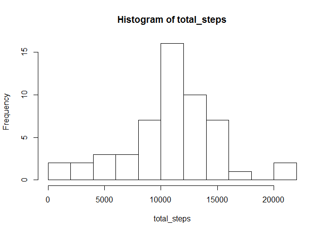
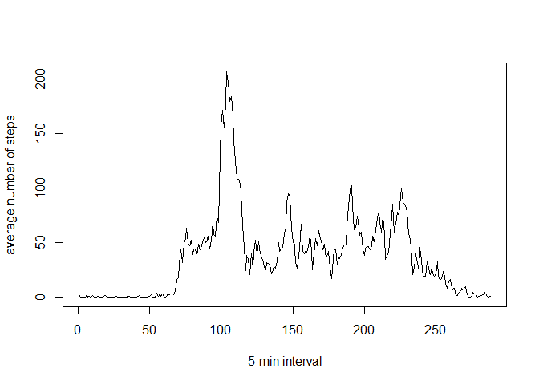
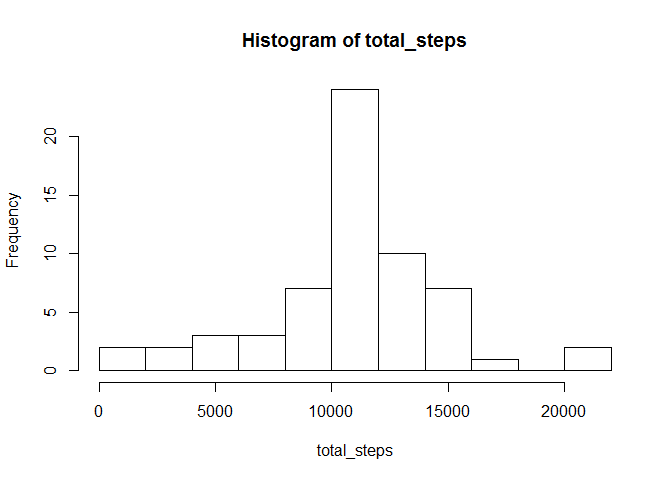
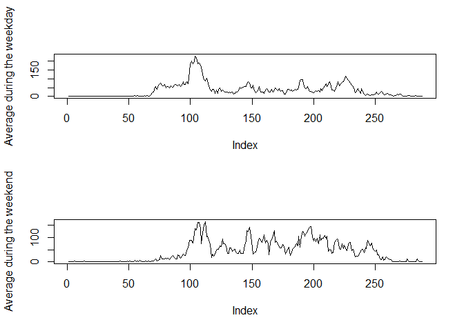

# Reproducible Research: Peer Assessment 1


```
## Warning: package 'knitr' was built under R version 3.2.3
```

## Loading and preprocessing the data

First we load the data from the file activity.csv and print the summary and the first 10 rows.

```r
activity <- read.csv("activity/activity.csv")
summary(activity)
```

```
##      steps                date          interval     
##  Min.   :  0.00   2012-10-01:  288   Min.   :   0.0  
##  1st Qu.:  0.00   2012-10-02:  288   1st Qu.: 588.8  
##  Median :  0.00   2012-10-03:  288   Median :1177.5  
##  Mean   : 37.38   2012-10-04:  288   Mean   :1177.5  
##  3rd Qu.: 12.00   2012-10-05:  288   3rd Qu.:1766.2  
##  Max.   :806.00   2012-10-06:  288   Max.   :2355.0  
##  NA's   :2304     (Other)   :15840
```

```r
activity[1:10, ]
```

```
##    steps       date interval
## 1     NA 2012-10-01        0
## 2     NA 2012-10-01        5
## 3     NA 2012-10-01       10
## 4     NA 2012-10-01       15
## 5     NA 2012-10-01       20
## 6     NA 2012-10-01       25
## 7     NA 2012-10-01       30
## 8     NA 2012-10-01       35
## 9     NA 2012-10-01       40
## 10    NA 2012-10-01       45
```

We see that there are 2304 missing values in the 'steps' column. Therefore, for the first part of our analysis we will remove those observations containing the missing values.


```r
activity_wo_NA <- na.omit(activity)
summary(activity_wo_NA)
```

```
##      steps                date          interval     
##  Min.   :  0.00   2012-10-02:  288   Min.   :   0.0  
##  1st Qu.:  0.00   2012-10-03:  288   1st Qu.: 588.8  
##  Median :  0.00   2012-10-04:  288   Median :1177.5  
##  Mean   : 37.38   2012-10-05:  288   Mean   :1177.5  
##  3rd Qu.: 12.00   2012-10-06:  288   3rd Qu.:1766.2  
##  Max.   :806.00   2012-10-07:  288   Max.   :2355.0  
##                   (Other)   :13536
```

## What is mean total number of steps taken per day?

Here is a hostogram of total number of steps taken each day.

```r
total_steps <- tapply(activity_wo_NA$steps, activity_wo_NA$date, sum)
hist(total_steps, breaks = 10)
```

<!-- -->

Here are the mean and median of the total number of steps taken per day.

```r
mean(total_steps, na.rm = TRUE)
```

```
## [1] 10766.19
```

```r
median(total_steps, na.rm = TRUE)
```

```
## [1] 10765
```
### Remark: We use na.rm = TRUE since total_steps contains some missing values because there are days with no information on the steps. 

## What is the average daily activity pattern?

First we compute an average number of steps taken during each 5-minute interval and make a time series plot.


```r
average_5min <- tapply(activity_wo_NA$steps, as.factor(activity_wo_NA$interval), mean)
plot(average_5min, type = "l", xlab = "5-min interval", ylab = "average number of steps")
```

<!-- -->

We see from this graph that the peak of activity occurs near 100 - 105 5-min interval. Let's determine this maximum precisely.


```r
which.max(average_5min) 
```

```
## 835 
## 104
```

We see that the maximum number of steps happened in the 104th interval, i. e., the one starting at 8:35.

## Imputing missing values

The total number of the missing values:


```r
sum(is.na(activity))
```

```
## [1] 2304
```

Our strategy to fill in the missing data will be to substitute 'NA' with the average number of steps in that 5-min interval over the given 2 month period of observations.

Now we create a new dataset with the missing data filled in according to our strategy.


```r
activity[is.na(activity[ , 1]), ][ , 1] <- average_5min[as.character(activity[is.na(activity[ , 1]), ][ , 3])]
```

Now we make a histogram of a total number of steps taken each day and calculate mean and median.


```r
total_steps <- tapply(activity$steps, activity$date, sum)
hist(total_steps, breaks = 10)
```

<!-- -->

```r
mean(total_steps, na.rm = TRUE)
```

```
## [1] 10766.19
```

```r
median(total_steps, na.rm = TRUE)
```

```
## [1] 10766.19
```

Comparing two histograms we see that there are more days in the bin which is in the middle. Mean doesn't change and the median changes and becomes equal to the mean. This is because there are 8 days with no observations. When we substituted the missing values by the averages we obtained that the average over the day didn't change, median became equal to mean since now we have 8 days with total number of steps equal to the average number of steps.

## Are there differences in activity patterns between weekdays and weekends?


```r
weekdays <- weekdays(as.Date(activity[ , 2])) 
weekdays <- ifelse(weekdays %in% c("Saturday", "Sunday"), "weekend", "weekday")
activity <- cbind(activity, weekdays)
activity_weekday <- split(activity, activity$weekdays)[[1]]
activity_weekend <- split(activity, activity$weekdays)[[2]]

average_5min_weekend <- tapply(activity_weekend$steps, as.factor(activity_weekend$interval), mean)


average_5min_weekday <- tapply(activity_weekday$steps, as.factor(activity_weekday$interval), mean)

par(mfrow = c(2,1))

plot(average_5min_weekday, type = "l", ylab = "Average during the weekday")
plot(average_5min_weekend, type = "l", ylab = "Average during the weekend")
```

<!-- -->

We see that there are differences in activity pattern during weekdays compare to weekends.
